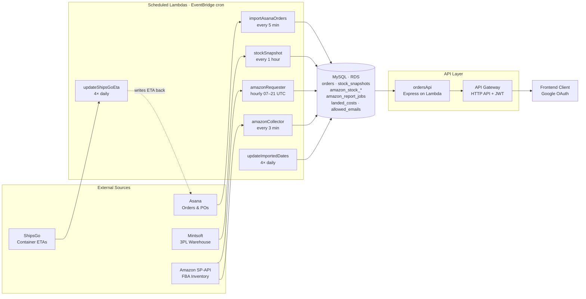
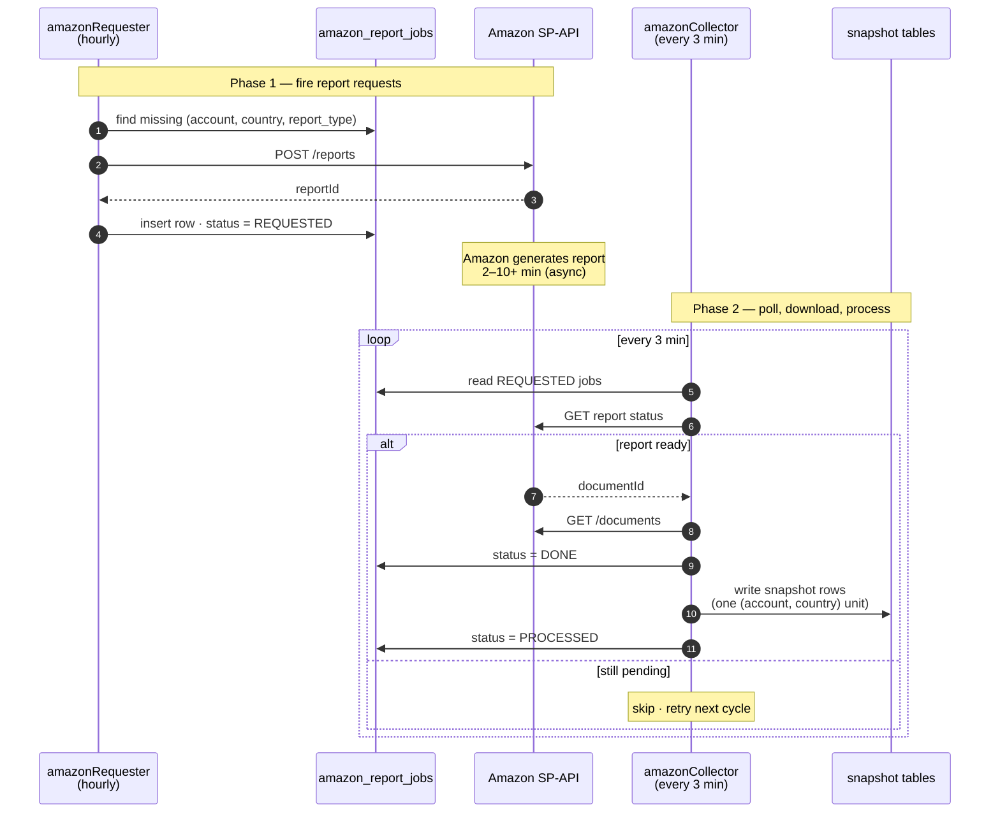
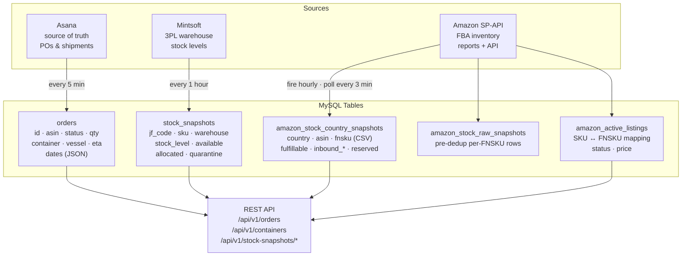
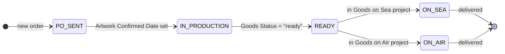

# Shipping & Orders Pipeline


A serverless backend that tracks the full lifecycle of product shipments — from purchase order through manufacturing, containerisation, ocean transit, and warehouse arrival. It aggregates stock data from **Mintsoft** (3PL warehouse), **Amazon SP-API** (FBA inventory), and **Asana** (order management) into a single MySQL database exposed via a REST API.

Deployed on **AWS Lambda** (Node.js 18) behind **API Gateway HTTP API** with Google JWT authentication, managed by the **Serverless Framework v3**.

---

## Architecture



### Amazon snapshot: two-phase design

SP-API reports are asynchronous (Amazon takes 2–10+ min to generate each one), so the pipeline is split:

- **`amazonRequester`** (hourly): fires `POST /reports` for every missing `(account, country, report_type)` unit in today's batch. Idempotent — rows already `REQUESTED`/`DONE`/`PROCESSED` are skipped. Writes a row to `amazon_report_jobs` per fired request.
- **`amazonCollector`** (every 3 min): polls outstanding `REQUESTED` jobs, downloads documents once Amazon marks them ready, then processes **one** `(account, country)` unit per run (downloads active listings + health report, calls inventory summaries API, writes snapshot rows). One unit per run keeps a slow country from blocking the others. A daily backfill sweep at 21:30 UTC fills any gaps from earlier failures.

Both Lambdas consume shared logic from [src/services/amazon-stock-shared.js](src/services/amazon-stock-shared.js).



### Data flow



### Order status lifecycle



Statuses are derived during Asana import via [src/domain/status-mappers.js](src/domain/status-mappers.js):

| Asana field | Result |
|---|---|
| Goods Status = `"ready"` | `READY` |
| Artwork Confirmed Date set | `IN_PRODUCTION` |
| Otherwise | `PO_SENT` |

Goods on Sea records are always `ON_SEA`. Goods on Air records are always `ON_AIR`.

---

## Project Structure

```
shipping/
  src/
    handlers/                       # Lambda entry points
      orders.js                     # Express REST API (ordersApi)
      mintsoft-snapshot.js          # Mintsoft warehouse snapshots (stockSnapshot)
      amazon-requester.js           # SP-API report request firing (amazonRequester)
      amazon-collector.js           # SP-API poll + process (amazonCollector)
      import-asana-orders.js        # Asana -> orders table (importAsanaOrders)
      update-shipsgo-eta.js         # ShipsGo ETA sync -> Asana (updateShipsGoEta)
      update-imported-dates.js      # Backfill import dates (updateImportedDates)

    services/                       # External API clients / shared I/O
      amazon-stock-shared.js        # SP-API auth, report download, writeSnapshots
      asana-service.js              # Asana REST client
      asana-transformer.js          # Asana task -> flat row transform
      mintsoft.js                   # Mintsoft REST client
      shipsgo.js                    # ShipsGo REST client (currently unused)

    domain/                         # Pure logic, no I/O
      status-mappers.js

    db/
      index.js                      # MySQL connection pool (singleton)
      migrations/                   # One-off schema migrations

    lib/
      logger.js                     # Structured logging

  tools/                            # Dev-only utilities (not deployed)
    reprocess-country.js            # Manually re-run one (account, country) snapshot

  serverless.yml                    # Serverless Framework deployment config
  package.json
  .env                              # Not committed
  .env.example                      # Template
```

---

## Lambda Functions

| Function (logical) | Handler | Trigger | Purpose |
|---|---|---|---|
| `ordersApi` | `src/handlers/orders.handler` | HTTP API (all `/api/v1/*` routes) | REST API for orders, containers, stock summaries |
| `stockSnapshot` | `src/handlers/mintsoft-snapshot.handler` | `rate(1 hour)` | Mintsoft warehouse stock by JF code |
| `amazonStockRequester` | `src/handlers/amazon-requester.handler` | `cron(0 7-21 * * ? *)` | Fires SP-API report requests (idempotent) |
| `amazonStockCollector` | `src/handlers/amazon-collector.handler` | `cron(0/3 7-21 * * ? *)` + daily `cron(30 21 * * ? *)` backfill | Polls SP-API, processes one unit per run |
| `importAsanaOrders` | `src/handlers/import-asana-orders.handler` | `rate(5 minutes)` | Syncs Asana projects to the `orders` table |
| `updateShipsGoEta` | `src/handlers/update-shipsgo-eta.handler` | 4x daily (08:55 / 11:55 / 14:55 / 17:55 UTC) | Pulls container ETAs from ShipsGo, pushes into Asana custom fields |
| `updateImportedDates` | `src/handlers/update-imported-dates.handler` | 4x daily (09:00 / 12:00 / 15:00 / 18:00 UTC) | Backfills `dates` column entries on imported orders |

All EventBridge cron expressions are UTC.

---

## REST API Endpoints

All endpoints require a Google JWT `Authorization` header (bypassed in local dev when `IS_OFFLINE` or `NODE_ENV=development` is set).

### Orders

| Method | Path | Description |
|---|---|---|
| `GET` | `/api/v1/orders` | List all orders |
| `POST` | `/api/v1/orders` | Create a new order (status: `PLANNING`) |
| `PUT` | `/api/v1/orders/:id` | Update order fields |
| `PATCH` | `/api/v1/orders/:id/status` | Move order to a new status (timestamps the transition) |
| `POST` | `/api/v1/orders/:id/split` | Split quantity off into a new `CONTAINERIZED` order |

### Containers

| Method | Path | Description |
|---|---|---|
| `POST` | `/api/v1/containers/pack` | Bulk-pack orders into a container |
| `PATCH` | `/api/v1/containers/:containerNumber/status` | Update status for all orders in a container |

### Stock Snapshots

| Method | Path | Description |
|---|---|---|
| `GET` | `/api/v1/stock-snapshots/sum?asin=...&company=...&days=30` | Aggregated stock summary for a single ASIN (Mintsoft + Amazon + orders + history) |
| `GET` | `/api/v1/stock-snapshots/sum/all-asins?company=...` | Full summary for every known ASIN |
| `GET` | `/api/v1/stock-snapshots/fnskus?asin=...&company=...` | SKU/FNSKU pairs per country |
| `GET` | `/api/v1/stock-snapshots/asana-tasks?asin=...` | Replenishment Asana tasks for an ASIN |
| `GET` | `/api/v1/stock-snapshots/oos-dates?asin=...&company=...` | Historical dates where `fulfillable = 0` per country |
| `GET` | `/api/v1/stock-snapshots/active-listings?asin=...&company=...` | Current listings + history |

#### Per-country latest-date semantics

> [!NOTE]
> Because the Amazon snapshot is written to the database one country at a time over a ~30-minute window each morning, the stock-snapshot endpoints resolve the **latest snapshot date per `(asin, country)`** rather than a single date per ASIN. A country that already wrote today's data shows today; a country still waiting in the collector queue continues showing yesterday. This prevents the partial-refresh "disappearing countries" artefact.

---

## Database Tables

### `orders`
Main table for tracking shipments through their lifecycle.

| Column | Type | Notes |
|---|---|---|
| `id` | VARCHAR | `ORD-XXXXXXXX` (UUID-based) or Asana task name |
| `asin` | VARCHAR | Amazon ASIN |
| `product_name` | VARCHAR | SKU or product description |
| `quantity` | INT | Units in this order line |
| `status` | VARCHAR | Current lifecycle status |
| `po_number` | VARCHAR | Purchase order reference |
| `supplier` | VARCHAR | Supplier name |
| `container_number` | VARCHAR | Shipping container ID |
| `vessel_name` | VARCHAR | Ship name |
| `eta` | DATE | Estimated arrival |
| `cbm_per_unit` | DECIMAL | Cubic metres per unit |
| `pack_size` | DECIMAL | Units per pack |
| `cbm_per_pack` | DECIMAL | Cubic metres per pack |
| `notes` | TEXT | Free-text notes |
| `dates` | JSON | Timestamped status transitions — `ordered`, `estimated_ready`, `shipped`, `eta`, etc |
| `location` | VARCHAR | Current physical location |
| `containerized_location` | VARCHAR | Location when containerized |
| `expected_shipping_date` | DATE | Planned shipping date |

### `stock_snapshots`
Hourly Mintsoft warehouse stock levels, keyed by SKU + warehouse + date.

| Column | Type | Notes |
|---|---|---|
| `jf_code` | VARCHAR | Internal JF product code |
| `asin` | VARCHAR | Amazon ASIN |
| `sku` | VARCHAR | Mintsoft SKU (may include suffixes like `_QC`, `_READY`) |
| `product_id` | INT | Mintsoft product ID |
| `warehouse_id` | INT | Mintsoft warehouse ID |
| `date_ran` | DATE | Snapshot date |
| `stock_level` | INT | Total stock |
| `available` | INT | Available for sale |
| `allocated` | INT | Reserved/allocated |
| `quarantine` | INT | In quarantine |

### `amazon_stock_country_snapshots`
Deduped Amazon FBA inventory, one row per `(date_ran, country, asin, company)`. Comma-separated FNSKU/SKU lists let a single row carry multi-FNSKU pools (re-stickered units, returns). Non-DE/UK marketplaces dedup against DE's FNSKU set to avoid double-counting Pan-EU / EFN inventory.

| Column | Type | Notes |
|---|---|---|
| `date_ran` | DATE | Snapshot date |
| `country` | VARCHAR | Marketplace code (`UK`, `DE`, `FR`, `ES`, `IT`) |
| `company` | VARCHAR | Account (`JFA` or `Hangerworld`) |
| `asin` | VARCHAR | Amazon ASIN |
| `fnsku` | VARCHAR(1000) | Comma-separated FNSKU list |
| `sku` | VARCHAR(1000) | Comma-separated SKU list |
| `condition_type` | VARCHAR | Usually `New` |
| `fulfillable` | INT | Available at FBA |
| `inbound_working` | INT | Inbound shipment being prepared |
| `inbound_shipped` | INT | In transit to FBA |
| `inbound_receiving` | INT | Being received at FBA |
| `reserved` | INT | Reserved (pending orders, transfers) |

### `amazon_stock_raw_snapshots`
Per-FNSKU rows before dedup/aggregation. Used for OOS date history and for backfill replay.

### `amazon_active_listings`
One row per listed SKU per country per day, carrying the SKU→FNSKU mapping and listing status/price. Used by `/stock-snapshots/active-listings` and `/stock-snapshots/fnskus`.

### `amazon_report_jobs`
Job tracker for the two-phase SP-API flow. One row per `(batch_date, account, country, report_type)`, with `status` progressing `REQUESTED → DONE → PROCESSED` (or `FAILED`). Populated by `amazonRequester`, consumed by `amazonCollector`.

### `allowed_emails`
Email allowlist for API access control (checked against the Google JWT email claim).

### `landed_costs`
Reference table mapping JF codes to ASINs — used by the Mintsoft snapshot to know which products to track.

---

## External Integrations

### Mintsoft (3PL Warehouse)
- **Base URL:** `https://api.mintsoft.co.uk/api`
- **Auth:** API key via query parameter
- **Used by:** [src/handlers/mintsoft-snapshot.js](src/handlers/mintsoft-snapshot.js) via [src/services/mintsoft.js](src/services/mintsoft.js)
- **Endpoints:** `/Product/Search` (find products by JF code), `/Product/StockLevels` (per-warehouse breakdown)
- **Rate limiting:** Batches of 10 concurrent requests with retry (3 attempts, exponential backoff)

### Amazon SP-API (Selling Partner)
- **Endpoint:** `https://sellingpartnerapi-eu.amazon.com`
- **Auth:** OAuth2 refresh token flow (45-min token cache, per-account)
- **Used by:** [src/handlers/amazon-requester.js](src/handlers/amazon-requester.js) + [src/handlers/amazon-collector.js](src/handlers/amazon-collector.js), both via [src/services/amazon-stock-shared.js](src/services/amazon-stock-shared.js)
- **Reports:** `GET_MERCHANT_LISTINGS_DATA` (active listings), `GET_FBA_INVENTORY_PLANNING_DATA` (health report), plus pan-EU enrolment check
- **Marketplaces:** UK, DE, FR, ES, IT
- **Accounts:** `JFA`, `Hangerworld` (separate credentials, independent rate-limit queues)
- **Dedup:** Non-DE/UK marketplace rows echo DE's physical FBA pool (Pan-EU / EFN). The writer reads DE's already-written FNSKU list for the day and skips matching rows on ES/FR/IT to avoid double-counting.
- **Fallback:** If a unit ends the day still `FAILED`, a backfill step can copy the previous day's successful row into today's slot so dashboards don't gap.

### Asana (Project Management)
- **Base URL:** `https://app.asana.com/api/1.0`
- **Auth:** Personal Access Token (PAT)
- **Used by:** [src/handlers/import-asana-orders.js](src/handlers/import-asana-orders.js) via [src/services/asana-service.js](src/services/asana-service.js)
- **Projects:**
  - `1210568539171010` — Goods on Sea → status `ON_SEA`
  - `1210880888784849` — Goods on Air → status `ON_AIR`
  - `1210599256348524` — Orders → status derived from `Goods Status` + `Artwork Confirmed Date`
- **Sync behavior:** Full replace (truncates `orders`, re-imports all three projects). Only truncates after validating at least one project returned data.

### ShipsGo (Container Tracking)
- **Base URL:** `https://api.shipsgo.com`
- **Auth:** API key header
- **Used by:** [src/handlers/update-shipsgo-eta.js](src/handlers/update-shipsgo-eta.js)
- **Flow:** For each `ON_SEA` order with a container number, fetch the latest ETA from ShipsGo and push it to the matching Asana task's custom field. Creates the shipment record in ShipsGo on first sight.

---

## Environment Variables

```bash
# Database
DB_HOST=
DB_USER=
DB_PASSWORD=
DB_NAME=
DB_PORT=3306

# Mintsoft
MINTSOFT_API_KEY=

# Asana
ASANA_PAT=

# Amazon SP-API — primary account (JFA)
AMAZON_SP_CLIENT_ID=
AMAZON_SP_CLIENT_SECRET=
AMAZON_SP_REFRESH_TOKEN=

# Amazon SP-API — secondary account (Hangerworld)
AMAZON_SP_CLIENT_ID_HW=
AMAZON_SP_CLIENT_SECRET_HW=
AMAZON_SP_REFRESH_TOKEN_HW=

# ShipsGo
SHIPSGO_API_KEY=
```

---

## Getting Started

### Prerequisites
- Node.js 18+
- MySQL database (or RDS)
- Credentials for Mintsoft, Asana, Amazon SP-API, ShipsGo

### Local development

```bash
npm install
cp .env.example .env   # then fill in

# Run the API server locally (Express directly on port 3001)
npm run dev
# -> http://localhost:3001

# Or use serverless-offline (uncomment plugin at the bottom of serverless.yml)
npm run offline
```

Auth is bypassed locally when `NODE_ENV=development` or `IS_OFFLINE` is set — requests are attributed to `local@dev`.

### Invoke a scheduled Lambda manually

Each scheduled handler has a `if (require.main === module)` bootstrap, so you can run them standalone:

```bash
node src/handlers/mintsoft-snapshot.js       # Mintsoft warehouse snapshot
node src/handlers/amazon-requester.js        # Fire SP-API report requests
node src/handlers/amazon-collector.js        # Poll + process one unit
node src/handlers/import-asana-orders.js     # Asana -> orders table
node src/handlers/update-shipsgo-eta.js
node src/handlers/update-imported-dates.js
```

These hit real external APIs and write to whatever DB your `.env` points at.

### Manually reprocess a single `(account, country)` snapshot

```bash
node tools/reprocess-country.js DE JFA
node tools/reprocess-country.js IT Hangerworld
```

Requires the relevant `amazon_report_jobs` rows to already exist for today (i.e. the requester has already fired).

### Deploy

```bash
npm run deploy
# Deploys all functions to AWS Lambda (eu-north-1)
```

---

## Authentication

- **Production:** Google JWT via API Gateway HTTP API authorizer. The email claim from the JWT is checked against the `allowed_emails` table.
- **Local dev:** Bypassed when `IS_OFFLINE` or `NODE_ENV=development` is set. Requests are attributed to `local@dev`.

---

## Key design decisions

- **Asana as source of truth:** `importAsanaOrders` runs every 5 minutes and does a full table replace. The REST API's CRUD operations on orders exist for container packing and manual overrides, but get overwritten on the next Asana sync. **Note:** Asana is planned to be replaced with a dedicated UI, eliminating the sync overhead.
- **Two-phase Amazon snapshot:** SP-API reports are async (2–10+ min), so firing and collecting are separate Lambdas. The alternative (one Lambda that polls with sleep) would burn Lambda compute while waiting and risk hitting the 15-minute timeout on slow reports.
- **One unit per collector invocation:** Processing all 10 `(account, country)` units sequentially in one run would let a slow country block the others. Splitting to one-per-invocation keeps progress liveness under SP-API rate limits and the Lambda timeout.
- **Per-country latest-date joins:** Stock-snapshot queries resolve the most recent snapshot per `(asin, country)` independently, so a mid-morning refresh showing today in DE and yesterday in ES/FR/IT displays the correct value for each rather than dropping the stragglers.
- **Snapshot-based stock tracking:** Stock levels are recorded as point-in-time snapshots rather than event streams, enabling historical trend queries over configurable date ranges.
- **Graceful degradation:** If an Amazon unit fails all day, the daily backfill copies the last successful snapshot so dashboards never show empty data.
- **Connection pooling:** A singleton MySQL pool ([src/db/index.js](src/db/index.js), limit 5) shared across Lambda invocations via container reuse.
