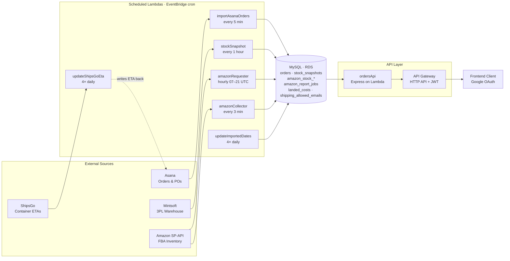
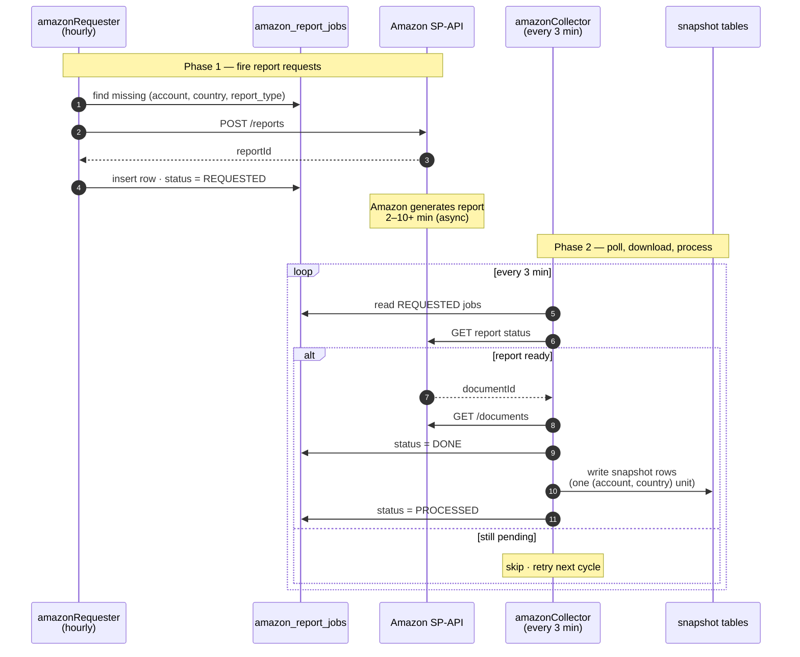
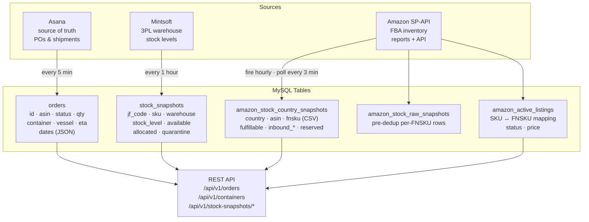
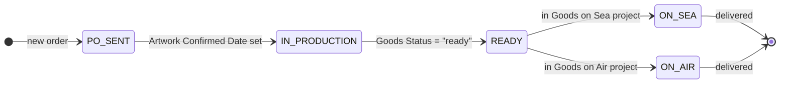

# Shipping & Orders Pipeline


A serverless backend that tracks the full lifecycle of product shipments — from purchase order through manufacturing, containerisation, ocean transit, and warehouse arrival. It aggregates stock data from **Mintsoft** (3PL warehouse), **Amazon SP-API** (FBA inventory), and **Asana** (order management) into a single MySQL database exposed via a REST API.

Deployed on **AWS Lambda** (Node.js 18) behind **API Gateway HTTP API** with Google JWT authentication, managed by the **Serverless Framework v3**.

---

## Architecture


```mermaid
flowchart LR
    subgraph sources["External Sources"]
        direction TB
        Asana[Asana<br/>Orders &amp; POs]
        Mint[Mintsoft<br/>3PL Warehouse]
        SPAPI[Amazon SP-API<br/>FBA Inventory]
        Ships[ShipsGo<br/>Container ETAs]
    end

    subgraph lambdas["Scheduled Lambdas · EventBridge cron"]
        direction TB
        L1[importAsanaOrders<br/>every 5 min]
        L2[stockSnapshot<br/>every 1 hour]
        L3[amazonRequester<br/>hourly 07–21 UTC]
        L4[amazonCollector<br/>every 3 min]
        L5[updateShipsGoEta<br/>4× daily]
        L6[updateImportedDates<br/>4× daily]
    end

    DB[("MySQL · RDS<br/>orders · stock_snapshots<br/>amazon_stock_*<br/>amazon_report_jobs<br/>landed_costs · shipping_allowed_emails")]

    subgraph api["API Layer"]
        direction TB
        Express[ordersApi<br/>Express on Lambda]
        Gateway[API Gateway<br/>HTTP API + JWT]
    end

    Client[Frontend Client<br/>Google OAuth]

    Asana --> L1
    Mint  --> L2
    SPAPI --> L3
    SPAPI --> L4
    Ships --> L5
    L5 -. writes ETA back .-> Asana

    L1 --> DB
    L2 --> DB
    L3 --> DB
    L4 --> DB
    L6 --> DB

    DB --> Express --> Gateway --> Client
```

### Amazon snapshot: two-phase design

SP-API reports are asynchronous (Amazon takes 2–10+ min to generate each one), so the pipeline is split:

- **`amazonRequester`** (hourly): fires `POST /reports` for every missing `(account, country, report_type)` unit in today's batch. Idempotent — rows already `REQUESTED`/`DONE`/`PROCESSED` are skipped. Writes a row to `amazon_report_jobs` per fired request.
- **`amazonCollector`** (every 3 min): polls outstanding `REQUESTED` jobs, downloads documents once Amazon marks them ready, then processes **one** `(account, country)` unit per run (downloads active listings + health report, calls inventory summaries API, writes snapshot rows). One unit per run keeps a slow country from blocking the others. A daily backfill sweep at 21:30 UTC fills any gaps from earlier failures.

Both Lambdas consume shared logic from [src/services/amazon-stock-shared.js](src/services/amazon-stock-shared.js).


```mermaid
sequenceDiagram
    autonumber
    participant R as amazonRequester<br/>(hourly)
    participant J as amazon_report_jobs
    participant SP as Amazon SP-API
    participant C as amazonCollector<br/>(every 3 min)
    participant DB as snapshot tables

    Note over R,SP: Phase 1 — fire report requests
    R->>J: find missing (account, country, report_type)
    R->>SP: POST /reports
    SP-->>R: reportId
    R->>J: insert row · status = REQUESTED

    Note over SP: Amazon generates report<br/>2–10+ min (async)

    Note over C,DB: Phase 2 — poll, download, process
    loop every 3 min
        C->>J: read REQUESTED jobs
        C->>SP: GET report status
        alt report ready
            SP-->>C: documentId
            C->>SP: GET /documents
            C->>J: status = DONE
            C->>DB: write snapshot rows<br/>(one (account, country) unit)
            C->>J: status = PROCESSED
        else still pending
            Note over C: skip · retry next cycle
        end
    end
```

### Data flow


```mermaid
flowchart TB
    subgraph srcs["Sources"]
        direction LR
        A["Asana<br/>source of truth<br/>POs &amp; shipments"]
        M["Mintsoft<br/>3PL warehouse<br/>stock levels"]
        SP["Amazon SP-API<br/>FBA inventory<br/>reports + API"]
    end

    subgraph tbls["MySQL Tables"]
        direction LR
        O["orders<br/>id · asin · status · qty<br/>container · vessel · eta<br/>dates (JSON)"]
        S["stock_snapshots<br/>jf_code · sku · warehouse<br/>stock_level · available<br/>allocated · quarantine"]
        AC["amazon_stock_country_snapshots<br/>country · asin · fnsku (CSV)<br/>fulfillable · inbound_* · reserved"]
        AR["amazon_stock_raw_snapshots<br/>pre-dedup per-FNSKU rows"]
        AL["amazon_active_listings<br/>SKU ↔ FNSKU mapping<br/>status · price"]
    end

    API["REST API<br/>/api/v1/orders<br/>/api/v1/containers<br/>/api/v1/stock-snapshots/*"]

    A  -->|every 5 min| O
    M  -->|every 1 hour| S
    SP -->|fire hourly · poll every 3 min| AC
    SP --> AR
    SP --> AL

    O  --> API
    S  --> API
    AC --> API
    AL --> API
```

### Order status lifecycle


```mermaid
stateDiagram-v2
    direction LR
    [*] --> PO_SENT : new order
    PO_SENT --> IN_PRODUCTION : Artwork Confirmed Date set
    IN_PRODUCTION --> READY : Goods Status = "ready"
    READY --> ON_SEA : in Goods on Sea project
    READY --> ON_AIR : in Goods on Air project
    ON_SEA --> [*] : delivered
    ON_AIR --> [*] : delivered
```

Statuses are derived during Asana import via [src/domain/status-mappers.js](src/domain/status-mappers.js):

| Asana field | Result |
|---|---|
| Goods Status = `"ready"` | `READY` |
| Artwork Confirmed Date set | `IN_PRODUCTION` |
| Otherwise | `PO_SENT` |

Goods on Sea records are always `ON_SEA`. Goods on Air records are always `ON_AIR`.

---

## Project Structure

```
shipping/
  src/
    handlers/                       # Lambda entry points
      orders.js                     # Express REST API (ordersApi)
      mintsoft-snapshot.js          # Mintsoft warehouse snapshots (stockSnapshot)
      amazon-requester.js           # SP-API report request firing (amazonRequester)
      amazon-collector.js           # SP-API poll + process (amazonCollector)
      import-asana-orders.js        # Asana -> orders table (importAsanaOrders)
      update-shipsgo-eta.js         # ShipsGo ETA sync -> Asana (updateShipsGoEta)
      update-imported-dates.js      # Backfill import dates (updateImportedDates)

    services/                       # External API clients / shared I/O
      amazon-stock-shared.js        # SP-API auth, report download, writeSnapshots
      asana-service.js              # Asana REST client
      asana-transformer.js          # Asana task -> flat row transform
      mintsoft.js                   # Mintsoft REST client
      shipsgo.js                    # ShipsGo REST client (currently unused)

    domain/                         # Pure logic, no I/O
      status-mappers.js

    db/
      index.js                      # MySQL connection pool (singleton)
      migrate/                      # Schema migrations, applied by deploy.sh (see "Schema changes")
      migrations/                   # Archive of the old hand-applied SQL; never executed

    lib/
      logger.js                     # Structured logging

  tools/                            # Dev-only utilities (not deployed)
    reprocess-country.js            # Manually re-run one (account, country) snapshot

  serverless.yml                    # Serverless Framework deployment config
  package.json
  .env                              # Not committed
  .env.example                      # Template
```

---

## Lambda Functions

| Function (logical) | Handler | Trigger | Purpose |
|---|---|---|---|
| `ordersApi` | `src/handlers/orders.handler` | HTTP API (all `/api/v1/*` routes) | REST API for orders, containers, stock summaries |
| `stockSnapshot` | `src/handlers/mintsoft-snapshot.handler` | `rate(1 hour)` | Mintsoft warehouse stock by JF code |
| `amazonStockRequester` | `src/handlers/amazon-requester.handler` | `cron(0 7-21 * * ? *)` | Fires SP-API report requests (idempotent) |
| `amazonStockCollector` | `src/handlers/amazon-collector.handler` | `cron(0/3 7-21 * * ? *)` + daily `cron(30 21 * * ? *)` backfill | Polls SP-API, processes one unit per run |
| `importAsanaOrders` | `src/handlers/import-asana-orders.handler` | `rate(5 minutes)` | Syncs Asana projects to the `orders` table |
| `updateShipsGoEta` | `src/handlers/update-shipsgo-eta.handler` | 4x daily (08:55 / 11:55 / 14:55 / 17:55 UTC) | Pulls container ETAs from ShipsGo, pushes into Asana custom fields |
| `updateImportedDates` | `src/handlers/update-imported-dates.handler` | 4x daily (09:00 / 12:00 / 15:00 / 18:00 UTC) | Backfills `dates` column entries on imported orders |

All EventBridge cron expressions are UTC.

---

## REST API Endpoints

All endpoints require a Google JWT `Authorization` header (bypassed in local dev when `IS_OFFLINE` or `NODE_ENV=development` is set).

### Orders

| Method | Path | Description |
|---|---|---|
| `GET` | `/api/v1/orders` | List all orders |
| `POST` | `/api/v1/orders` | Create a new order (status: `PLANNING`) |
| `PUT` | `/api/v1/orders/:id` | Update order fields |
| `PATCH` | `/api/v1/orders/:id/status` | Move order to a new status (timestamps the transition) |
| `POST` | `/api/v1/orders/:id/split` | Split quantity off into a new `CONTAINERIZED` order |

### Containers

| Method | Path | Description |
|---|---|---|
| `POST` | `/api/v1/containers/pack` | Bulk-pack orders into a container |
| `PATCH` | `/api/v1/containers/:containerNumber/status` | Update status for all orders in a container |

### Draft containers — lifecycle and history

Every draft container has a permanent history (lines, documents, emails, renames, conversion / deletion) kept in `audit_log` as `entity_type = 'draft_container'` against a stable id from the `draft_containers` registry. See [docs/draft-container-audit-frontend.md](docs/draft-container-audit-frontend.md).

| Method | Path | Description |
|---|---|---|
| `POST` | `/api/v1/draft-containers/rename` | Rename a draft everywhere it is keyed by name (lines, documents, QA sheets) in one transaction; `409` if the target name is in use |
| `POST` | `/api/v1/draft-containers/close` | Delete every line of a draft and record why — `reason: 'deleted'` or `'converted'` (+ the real container's details) |
| `GET` | `/api/v1/draft-container-registry` | Every draft that ever existed, with status and live counts (`?name=`, `?q=`, `?status=`, `?limit=`) |
| `GET` | `/api/v1/audit-log?entityType=draft_container&entityId=…` | One draft's full history |

### Stock Snapshots

| Method | Path | Description |
|---|---|---|
| `GET` | `/api/v1/stock-snapshots/sum?asin=...&company=...&days=30` | Aggregated stock summary for a single ASIN (Mintsoft + Amazon + orders + history), plus `mintsoft_by_sku`. `history.amazon` is the per-day total across countries; `history.amazon_by_country` is the same daily series split per country (`{ UK: [...], US: [...] }`) — series start on different days, a missing day means no snapshot, not zero |
| `GET` | `/api/v1/stock-snapshots/sum/all-asins?company=...` | Full summary for every known ASIN, plus `mintsoft_by_sku` per ASIN |
| `GET` | `/api/v1/stock-snapshots/fnskus?asin=...&company=...` | SKU/FNSKU pairs per country |
| `GET` | `/api/v1/stock-snapshots/asana-tasks?asin=...` | Replenishment Asana tasks for an ASIN |
| `GET` | `/api/v1/stock-snapshots/oos-dates?asin=...&company=...` | Historical dates where `fulfillable = 0` per country |
| `GET` | `/api/v1/stock-snapshots/active-listings?asin=...&company=...` | Current listings + history |
| `POST` | `/api/v1/stock-snapshots/refresh` (body/query `jfCode`) | Live Mintsoft refresh of ONE jf_code — bare SKU plus its whitelisted children (`_TR`, `_QC`, `_IFU`, …) — instead of waiting for the hourly sweep |

#### `mintsoft_by_sku` — per-child-SKU breakdown

The `mintsoft_stock_level` / `_available` / `_allocated` / `_quarantine` figures are the **sum across a JF code's whitelisted child SKUs** (bare code + `_TR` trade, `_QC`, `_READY`, `_IFU`, `_LABELLED`, … — see `SKU_SUFFIXES` in [src/services/mintsoft.js](src/services/mintsoft.js)). `mintsoft_by_sku` splits that total back out so it's clear which child holds the units — 4,000 units reads very differently when 3,500 of them sit in `_TR`.

Entries sum exactly to the four aggregate figures. Bare SKU first, then suffixes A–Z. Each entry also carries its per-warehouse split (today everything lives in warehouse 7, but the grain is preserved):

```json
"mintsoft_by_sku": [
  { "sku": "HW0168", "jf_code": "HW0168", "suffix": null, "is_base": true,
    "product_id": 9277, "stock_level": 4702, "available": 4702, "allocated": 0, "quarantine": 0,
    "warehouses": [{ "warehouse_id": 7, "stock_level": 4702, "available": 4702, "allocated": 0, "quarantine": 0 }] },
  { "sku": "HW0168_TR", "jf_code": "HW0168", "suffix": "_TR", "is_base": false,
    "product_id": 10309, "stock_level": 4, "available": 4, "allocated": 0, "quarantine": 0,
    "warehouses": [{ "warehouse_id": 7, "stock_level": 4, "available": 4, "allocated": 0, "quarantine": 0 }] }
]
```

`POST /stock-snapshots/refresh` returns the same `mintsoft_by_sku` shape alongside its flat `skus` array, so the breakdown renders identically whichever endpoint the caller read.

#### Per-country latest-date semantics

> [!NOTE]
> Because the Amazon snapshot is written to the database one country at a time over a ~30-minute window each morning, the stock-snapshot endpoints resolve the **latest snapshot date per `(asin, country)`** rather than a single date per ASIN. A country that already wrote today's data shows today; a country still waiting in the collector queue continues showing yesterday. This prevents the partial-refresh "disappearing countries" artefact.

### Adjusted Sales

Ops-entered override of the sales figure for an ASIN in one marketplace, stored at the same `(asin, country)` grain as `amazon_stock_country_snapshots`. Country is one of `UK`, `DE`, `FR`, `IT`, `ES`, `US`, `EU`, or `ALL` (reserved for a single cross-market figure).

One **live row per `(asin, country)`** holding a current value — not a time series. Every change is written to `audit_log` under `entity_type = 'adjusted_sales'`, so history is recoverable via `GET /api/v1/audit-log?entityType=adjusted_sales&entityId=<id>`. Deletes are soft; re-creating a deleted key revives the same row (and its id).

| Method | Path | Description |
|---|---|---|
| `GET` | `/api/v1/adjusted-sales?asin=...&country=...` | List; both filters optional |
| `GET` | `/api/v1/adjusted-sales/:asin` | Every country's figure for one ASIN — `data` array plus a `byCountry` map |
| `POST` | `/api/v1/adjusted-sales` | Create. `409` if a live row already holds the key |
| `PUT` | `/api/v1/adjusted-sales/:id` | Update by numeric id |
| `PUT` | `/api/v1/adjusted-sales/:asin` | **Bulk** — set several/all countries in one request |
| `PUT` | `/api/v1/adjusted-sales/:asin/:country` | Upsert by natural key — `201` when created, `200` when updated |
| `DELETE` | `/api/v1/adjusted-sales/:id` | Soft-delete by id |
| `DELETE` | `/api/v1/adjusted-sales/:asin/:country` | Soft-delete by natural key |

Body for POST/PUT: `{ "asin": "B0...", "country": "UK", "adjustedSales": 1250.5, "note": "seasonal uplift" }` — `asin`/`country` are path- or body-supplied depending on the route, `note` is optional (omit on PUT to keep the existing note, send `null` to clear it). `adjustedSales` must be `>= 0`; `0` is valid and means "assume this ASIN doesn't sell here".

The figure is accepted as either **`adjustedSales` or `adjusted_sales`** (these routes speak camelCase but the stock endpoints return snake_case, so both are honoured), from a JSON body or a query param, and a body sent without `Content-Type: application/json` is parsed rather than silently read as empty.

#### Bulk update — `PUT /api/v1/adjusted-sales/:asin`

All forms are upserts. **A different figure per country**, in one request — the `countries` wrapper is optional and either key casing works:

```jsonc
{ "countries": { "UK": 920, "DE": 300, "FR": 150 } }                    // map
{ "UK": 920, "DE": 300, "FR": 150 }                                     // bare map
[ { "country": "UK", "adjustedSales": 920 },
  { "country": "DE", "adjusted_sales": 300 } ]                          // array
{ "countries": [ { "country": "UK", "adjustedSales": 920, "note": "..." } ] }
{ "countries": { "UK": { "adjustedSales": 920, "note": "per-country note" } } }
```

**The same figure across countries:**

```jsonc
{ "countries": ["UK", "DE"], "adjustedSales": 920 }   // named countries
{ "adjustedSales": 920 }                              // every marketplace
```

`countries` also accepts a CSV string (`"IT,ES"`) or `"*"`. Omitting it — or passing `"*"` — targets the six real marketplaces `UK, DE, FR, IT, ES, US`; the `EU` and `ALL` pseudo-countries must be named explicitly, so a blanket update can't silently write a cross-market figure.

A per-country map combined with a top-level `adjustedSales` is rejected as ambiguous rather than guessed at. A top-level `note` applies to every country that doesn't carry its own.

Runs in a **single transaction** and validates the whole batch up front: one bad country or negative value rejects the request with `400` and writes nothing. The response carries both what changed and the ASIN's resulting full state, so a grid can refresh without a follow-up GET:

```json
{ "asin": "B0...", "created": 3, "updated": 3,
  "results": [{ "country": "UK", "adjustedSales": 920, "action": "updated", "id": 10, "...": "" }],
  "data": [ "...every live row for this ASIN..." ],
  "byCountry": { "UK": { "...": "" } } }
```

> [!NOTE]
> Nothing else in the API consumes this figure yet — the stock-snapshot endpoints are unchanged. It is written and read back through these routes only.

---

## Database Tables

### `orders`
Main table for tracking shipments through their lifecycle.

| Column | Type | Notes |
|---|---|---|
| `id` | VARCHAR | `ORD-XXXXXXXX` (UUID-based) or Asana task name |
| `asin` | VARCHAR | Amazon ASIN |
| `product_name` | VARCHAR | SKU or product description |
| `quantity` | INT | Units in this order line |
| `status` | VARCHAR | Current lifecycle status |
| `po_number` | VARCHAR | Purchase order reference |
| `supplier` | VARCHAR | Supplier name |
| `container_number` | VARCHAR | Shipping container ID |
| `vessel_name` | VARCHAR | Ship name |
| `eta` | DATE | Estimated arrival |
| `cbm_per_unit` | DECIMAL | Cubic metres per unit |
| `pack_size` | DECIMAL | Units per pack |
| `cbm_per_pack` | DECIMAL | Cubic metres per pack |
| `notes` | TEXT | Free-text notes |
| `dates` | JSON | Timestamped status transitions — `ordered`, `estimated_ready`, `shipped`, `eta`, etc |
| `location` | VARCHAR | Current physical location |
| `containerized_location` | VARCHAR | Location when containerized |
| `expected_shipping_date` | DATE | Planned shipping date |

### `stock_snapshots`
Hourly Mintsoft warehouse stock levels, keyed by SKU + warehouse + date.

| Column | Type | Notes |
|---|---|---|
| `jf_code` | VARCHAR | Internal JF product code |
| `asin` | VARCHAR | Amazon ASIN |
| `sku` | VARCHAR | Mintsoft SKU (may include suffixes like `_QC`, `_READY`) |
| `product_id` | INT | Mintsoft product ID |
| `warehouse_id` | INT | Mintsoft warehouse ID |
| `date_ran` | DATE | Snapshot date |
| `stock_level` | INT | Total stock |
| `available` | INT | Available for sale |
| `allocated` | INT | Reserved/allocated |
| `quarantine` | INT | In quarantine |

### `adjusted_sales`
Manually adjusted sales figures, one live row per `(asin, country)`. See [Adjusted Sales](#adjusted-sales) above; schema in [src/db/migrate/2026-09-21_00_baseline.sql](src/db/migrate/2026-09-21_00_baseline.sql).

| Column | Type | Notes |
|---|---|---|
| `asin` | VARCHAR(20) | Amazon ASIN |
| `country` | VARCHAR(8) | `UK`/`DE`/`FR`/`IT`/`ES`/`US`/`EU`, or `ALL` for cross-market |
| `adjusted_sales` | DECIMAL(12,2) | The override figure; `>= 0` |
| `note` | VARCHAR(500) | Optional reason for the adjustment |
| `created_by_email` / `updated_by_email` | VARCHAR | Actor from the JWT |
| `deleted_at` | DATETIME | Soft delete — the unique key spans deleted rows, so re-creating a key revives it |

### `amazon_stock_country_snapshots`
Deduped Amazon FBA inventory, one row per `(date_ran, country, asin, company)`. Comma-separated FNSKU/SKU lists let a single row carry multi-FNSKU pools (re-stickered units, returns). Non-DE/UK marketplaces dedup against DE's FNSKU set to avoid double-counting Pan-EU / EFN inventory.

| Column | Type | Notes |
|---|---|---|
| `date_ran` | DATE | Snapshot date |
| `country` | VARCHAR | Marketplace code (`UK`, `DE`, `FR`, `ES`, `IT`) |
| `company` | VARCHAR | Account (`JFA` or `Hangerworld`) |
| `asin` | VARCHAR | Amazon ASIN |
| `fnsku` | VARCHAR(1000) | Comma-separated FNSKU list |
| `sku` | VARCHAR(1000) | Comma-separated SKU list |
| `condition_type` | VARCHAR | Usually `New` |
| `fulfillable` | INT | Available at FBA |
| `inbound_working` | INT | Inbound shipment being prepared |
| `inbound_shipped` | INT | In transit to FBA |
| `inbound_receiving` | INT | Being received at FBA |
| `reserved` | INT | Reserved (pending orders, transfers) |

### `amazon_stock_raw_snapshots`
Per-FNSKU rows before dedup/aggregation. Used for OOS date history and for backfill replay.

### `amazon_active_listings`
One row per listed SKU per country per day, carrying the SKU→FNSKU mapping and listing status/price. Used by `/stock-snapshots/active-listings` and `/stock-snapshots/fnskus`.

### `amazon_report_jobs`
Job tracker for the two-phase SP-API flow. One row per `(batch_date, account, country, report_type)`, with `status` progressing `REQUESTED → DONE → PROCESSED` (or `FAILED`). Populated by `amazonRequester`, consumed by `amazonCollector`.

### `shipping_allowed_emails`
This app's user allowlist — checked against the Google JWT email claim on every request, managed through `/api/v1/users`. Columns: `id`, `email` (unique, lower-cased), `display_name`, `type`, `created_at`, `updated_at`.

`type` is free-form, not an enum: the set of roles is whatever `SELECT DISTINCT type` currently returns (`/api/v1/user-types`), so introducing a role means assigning it to someone — never a deploy. Writes are validated on shape only (lower-case letters/digits/`-`/`_`, ≤32 chars). Two roles are structural and always offered even with no rows: `standard` (the default) and `admin` (the one that unlocks the admin-gated routes). A role stops being listed once its last user is removed.

It is deliberately **not** `allowed_emails`: that table is shared with joshdex's API (`perp.js` runs against the same `jfa` schema and exposes its own `/allowed-emails` CRUD), so a grant or revoke there changed who could log into both apps. `shipping_allowed_emails` was seeded once with a copy of those rows and is ShipLine's alone from then on; `allowed_emails` is left untouched for joshdex. See [src/lib/allowed-emails.js](src/lib/allowed-emails.js).

### `landed_costs`
Reference table mapping JF codes to ASINs — used by the Mintsoft snapshot to know which products to track.

---

## External Integrations

### Mintsoft (3PL Warehouse)
- **Base URL:** `https://api.mintsoft.co.uk/api`
- **Auth:** API key via query parameter
- **Used by:** [src/handlers/mintsoft-snapshot.js](src/handlers/mintsoft-snapshot.js) via [src/services/mintsoft.js](src/services/mintsoft.js)
- **Endpoints:** `/Product/Search` (find products by JF code), `/Product/StockLevels` (per-warehouse breakdown)
- **Rate limiting:** Batches of 10 concurrent requests with retry (3 attempts, exponential backoff)

### Amazon SP-API (Selling Partner)
- **Endpoint:** `https://sellingpartnerapi-eu.amazon.com`
- **Auth:** OAuth2 refresh token flow (45-min token cache, per-account)
- **Used by:** [src/handlers/amazon-requester.js](src/handlers/amazon-requester.js) + [src/handlers/amazon-collector.js](src/handlers/amazon-collector.js), both via [src/services/amazon-stock-shared.js](src/services/amazon-stock-shared.js)
- **Reports:** `GET_MERCHANT_LISTINGS_DATA` (active listings), `GET_FBA_INVENTORY_PLANNING_DATA` (health report), plus pan-EU enrolment check
- **Marketplaces:** UK, DE, FR, ES, IT
- **Accounts:** `JFA`, `Hangerworld` (separate credentials, independent rate-limit queues)
- **Dedup:** Non-DE/UK marketplace rows echo DE's physical FBA pool (Pan-EU / EFN). The writer reads DE's already-written FNSKU list for the day and skips matching rows on ES/FR/IT to avoid double-counting.
- **Fallback:** If a unit ends the day still `FAILED`, a backfill step can copy the previous day's successful row into today's slot so dashboards don't gap.

### Asana (Project Management)
- **Base URL:** `https://app.asana.com/api/1.0`
- **Auth:** Personal Access Token (PAT)
- **Used by:** [src/handlers/import-asana-orders.js](src/handlers/import-asana-orders.js) via [src/services/asana-service.js](src/services/asana-service.js)
- **Projects:**
  - `1210568539171010` — Goods on Sea → status `ON_SEA`
  - `1210880888784849` — Goods on Air → status `ON_AIR`
  - `1210599256348524` — Orders → status derived from `Goods Status` + `Artwork Confirmed Date`
- **Sync behavior:** Full replace (truncates `orders`, re-imports all three projects). Only truncates after validating at least one project returned data.

### ShipsGo (Container Tracking)
- **Base URL:** `https://api.shipsgo.com`
- **Auth:** API key header
- **Used by:** [src/handlers/update-shipsgo-eta.js](src/handlers/update-shipsgo-eta.js)
- **Flow:** For each `ON_SEA` order with a container number, fetch the latest ETA from ShipsGo and push it to the matching Asana task's custom field. Creates the shipment record in ShipsGo on first sight.

---

## Environments

Two CloudFormation stacks, both in `eu-north-1`:

| Deploy command | Stage | `envName` | Stack | Secret | Schedules |
|---|---|---|---|---|---|
| `bash deploy.sh` | `dev` | **`prod`** | `shipping-serverless-dev` | `shipping/prod` | enabled |
| `bash deploy.sh test` | `test` | `test` | `shipping-serverless-test` | `shipping/test` | disabled |

> **The stage `dev` IS production.** The live stack was first deployed under the
> Serverless default stage and a CloudFormation stack cannot be renamed in place —
> renaming would mean a brand-new stack, a new API Gateway URL and an S3 data
> migration. So the stage stays `dev` and `custom.envName` in `serverless.yml`
> maps it to the honest name. **Everything new keys off `custom.envName`, never
> the raw stage.** The only remaining "dev" is the existing stack/bucket names in
> the AWS console.

The test stack is a full parallel copy — its own API Gateway URL, Lambdas and
`shipping-purchase-orders-test` bucket — pointed at the `explorer-test` DB
replica. Every schedule is gated by `custom.schedulesEnabled` (default `false`),
so the test stack never ingests orders, mutates Mintsoft, registers ShipsGo
containers or sends supplier email. The EventBridge rules still exist (visible,
DISABLED), so `aws lambda invoke` against a test function still works when you
deliberately want it to.

---

## Environment Variables

Config lives in **two places**, and they are not the same place:

- **Deployed Lambdas** read one flat JSON secret per environment in AWS Secrets
  Manager — `shipping/prod` and `shipping/test`. `serverless.yml` resolves it at
  **deploy time** (`custom.secrets`) and bakes the values into the Lambda
  environment: no runtime fetch, no added latency, no code changes. Rotating a
  value means updating the secret **and redeploying**. Whoever deploys needs
  `secretsmanager:GetSecretValue`.
- **Local runs** (`npm run dev`, `node src/handlers/*.js`, `node tools/*.js`)
  read `.env` directly via `dotenv` and never touch Secrets Manager. `.env` is
  local-only and not committed.

```bash
# Update a value (then redeploy for it to reach the Lambdas)
aws secretsmanager put-secret-value --secret-id shipping/prod \
  --secret-string file://prod.secret.json --region eu-north-1
```

> **Gotcha:** several vars have a fallback chain (`DB_PROXY_HOST` → `DB_HOST`) or
> a default (`FRONT_API_TOKEN, ''`). A key that should "not be set" must be
> **absent from the secret JSON entirely** — an empty string is a present value
> and wins over the fallback. This is why `shipping/test` has no
> `DB_PROXY_HOST`: the test replica is reached directly, not through the proxy.

The keys below are the same in both the secret and `.env`:

```bash
# Database
DB_HOST=
DB_USER=
DB_PASSWORD=
DB_NAME=
DB_PORT=3306

# Mintsoft
MINTSOFT_API_KEY=

# Asana
ASANA_PAT=

# Amazon SP-API — primary account (JFA)
AMAZON_SP_CLIENT_ID=
AMAZON_SP_CLIENT_SECRET=
AMAZON_SP_REFRESH_TOKEN=

# Amazon SP-API — secondary account (Hangerworld)
AMAZON_SP_CLIENT_ID_HW=
AMAZON_SP_CLIENT_SECRET_HW=
AMAZON_SP_REFRESH_TOKEN_HW=

# ShipsGo
SHIPSGO_API_KEY=
```

---

## Getting Started

### Prerequisites
- Node.js 18+
- MySQL database (or RDS)
- Credentials for Mintsoft, Asana, Amazon SP-API, ShipsGo

### Local development

```bash
npm install
cp .env.example .env   # then fill in

# Run the API server locally (Express directly on port 3001)
npm run dev
# -> http://localhost:3001

# Or use serverless-offline (uncomment plugin at the bottom of serverless.yml)
npm run offline
```

Auth is bypassed locally when `NODE_ENV=development` or `IS_OFFLINE` is set — requests are attributed to `local@dev`.

### Frontend against a local API (no deploy)

Same arrangement as JFPRO's `api/`: run this backend on your machine and point a
local ShipLine at it, so routes can be tried before they are deployed anywhere.

```bash
# 1. here — auth bypassed (IS_OFFLINE), role admin, port 3031 (JFPRO's local
#    api/ owns 3001 and is often up at the same time). Prints the database it
#    will write to first: keep .env on the TEST instance.
npm run dev:local

# 2. in ../ShipLine — one gitignored file, one line:
#      .env.development.local   →   VITE_API_BASE_URL=http://localhost:3031
#    then the frontend on port 3030 (mode development reads that file;
#    `vite build` never does)
npm run dev:local
# -> http://localhost:3030 talking to http://localhost:3031
```

`ORDERS_PORT` and `LOCAL_USER_TYPE` (`admin` | `standard`) override the
defaults. Other gateways (JFPRO, Cashboard, Workflows) still resolve to their
TEST stacks — only ShipLine's own API is local. Delete
`.env.development.local` to go back to the deployed test stack. Mind that
emails (Front), Mintsoft and S3 are the real integrations from `.env`.

Sanity check while it runs: `node tools/test-draft-container-audit.js <orderA> <orderB>`
(the older `tools/test-*.js` scripts default to port 3001 — pass
`TEST_BASE_URL=http://localhost:3031` to point them here).

### Invoke a scheduled Lambda manually

Each scheduled handler has a `if (require.main === module)` bootstrap, so you can run them standalone:

```bash
node src/handlers/mintsoft-snapshot.js       # Mintsoft warehouse snapshot
node src/handlers/amazon-requester.js        # Fire SP-API report requests
node src/handlers/amazon-collector.js        # Poll + process one unit
node src/handlers/import-asana-orders.js     # Asana -> orders table
node src/handlers/update-shipsgo-eta.js
node src/handlers/update-imported-dates.js
```

These hit real external APIs and write to whatever DB your `.env` points at.

### Manually reprocess a single `(account, country)` snapshot

```bash
node tools/reprocess-country.js DE JFA
node tools/reprocess-country.js IT Hangerworld
```

Requires the relevant `amazon_report_jobs` rows to already exist for today (i.e. the requester has already fired).

### Deploy

```bash
bash deploy.sh          # stage "dev"  -> PRODUCTION (shipping-serverless-dev)
bash deploy.sh test     # stage "test" -> the test stack (shipping-serverless-test)
```

`deploy.sh` first applies pending schema migrations to that stage's database
(`node tools/migrate.js --stage <stage> --apply`, see [Schema changes](#schema-changes));
a failed migration stops the deploy before any code ships. The deployer needs
`secretsmanager:GetSecretValue` on `shipping/prod` / `shipping/test`, as for the
deploy itself.

Use `deploy.sh`, not `npm run deploy` — it skips the migrations, and on Windows,
packaging the full `node_modules` tree blows past the OS file-handle limit and
`serverless deploy` bails with `EMFILE: too many open files`. The script prunes
to production deps and preloads `graceful-fs` to get under it, then restores
devDeps.

Resolve the config for either stage **without deploying** — this reads the
Secrets Manager secret, so it's the way to check a value landed:

```bash
serverless print --path provider.environment.DB_HOST
serverless print --stage test --path provider.environment.DB_HOST
serverless print --stage test --path functions.frontStatusImport
```

(`--path` reports "not found" for a value that resolves to an empty string; use
`--path provider.environment --format json` to see those.)

### Schema changes

The Lambdas run no DDL. Schema lives in [src/db/migrate/](src/db/migrate/), one
file per change, applied in filename order by [tools/migrate.js](tools/migrate.js)
and recorded in the `schema_migrations` table. `deploy.sh` runs it before
`serverless deploy`.

```bash
node tools/migrate.js --stage test             # dry run: what is pending on TEST
node tools/migrate.js --stage test --apply     # apply it (deploy.sh does this for you)
node tools/migrate.js --stage dev --status     # production: applied / pending / changed files, missing views
npm run test:unit                              # includes tools/test-migrate-lib.js
```

`--stage` reads the database from the stage's secret (`dev` -> `shipping/prod`,
`test` -> `shipping/test`) and connects to its direct `DB_HOST`, not the RDS
Proxy, which is unreachable from outside the VPC. It refuses a stage whose host
does not look like it (TEST must contain "test", production must not). Without
`--stage` it uses `.env`, and writing then needs `--confirm-host <DB_HOST>`.

Writing a migration:

- Name it `YYYY-MM-DD_NN_what_it_does.sql` (or `.js` exporting
  `up(conn, { log, env })`), dated after the newest file.
- Make it safe to run twice. MySQL DDL is not transactional, so a failed run
  can leave half a file applied, and the file is recorded only once every
  statement has run: `CREATE TABLE IF NOT EXISTS`, **one clause per `ALTER`**,
  `INSERT IGNORE` for seeds. "Already exists" errors (table, column, index,
  and for `DROP` "already gone") are skipped, so a re-run finishes the job.
- Additive first: the DDL lands a few minutes before the code that uses it,
  and the old code must keep working against it. Drop or rename in a later
  deploy, once nothing reads the old shape.
- Never edit an applied file (it is not re-run; `--status` flags the changed
  checksum). Add a new one.
- No `SET SESSION` in files: the runner sets `lock_wait_timeout = 5` itself,
  so an `ALTER` on a busy table fails fast (and the deploy with it; just re-run)
  instead of queueing every query behind its metadata lock.

The first file, `2026-09-21_00_baseline.sql`, is the app's tables as they stood
when this was introduced, generated from production with `--dump-baseline`. It
runs only on an empty database. A populated database with no ledger (production
before its first migrated deploy) is *adopted* instead: `--apply` first checks it
against the baseline (`--verify-baseline` shows the same report), records the
baseline without running it, then applies the rest. It refuses a database that
lacks part of the baseline. `--adopt` does the check-and-record step on its own.

`explorer-test` is rebuilt from production's latest snapshot every third day
(02:00 UTC, days 1, 4, 7, … of the month), ledger included: it comes back
knowing exactly what production has applied, and the next `deploy.sh test`
re-applies whatever is newer, which the idempotency rule makes safe.

`src/db/migrations/` is the archive of the old hand-applied files and is never
executed; the views over `jfpro` (`product_carton_sizes`, `suppliers`,
`supplier_emails`) still come from there, applied by hand as admin.

Each Lambda container checks once, on its first request, that every bundled
migration is in `schema_migrations`, and logs `[schema] database schema is
behind the code` if not (e.g. after a deploy that skipped `deploy.sh`). It never
blocks a request.

---

## Authentication

- **Production:** Google JWT via API Gateway HTTP API authorizer. The email claim from the JWT is checked against the `shipping_allowed_emails` table on every request (no cache — a grant or revoke lands on that user's next request). The row's `type` is exposed to the frontend as the `X-User-Type` response header and to routes as `req.userType`; `admin` is the only role the API itself treats specially.
- **Local dev:** Bypassed when `IS_OFFLINE` or `NODE_ENV=development` is set. Requests are attributed to `local@dev`, with the role taken from `LOCAL_USER_TYPE` (default `standard`) so admin-gated routes can be exercised locally.
- **Bootstrap:** on a schema with no users to copy, the comma-separated `BOOTSTRAP_ADMIN_EMAILS` env var seeds the first admins — without it every authed request would 401.

### Managing users — `/api/v1/users`

Full CRUD over the allowlist. Admin-only apart from `GET /me`, since the list decides who can reach the API at all. Every mutation is written to `audit_log` under `entity_type='user'`.

| Method | Path | Notes |
|---|---|---|
| `GET` | `/api/v1/users?type=&q=` | List; optional role filter and email/name search |
| `GET` | `/api/v1/users/me` | The caller's own record — open to every allowlisted user |
| `GET` | `/api/v1/users/:email` | One user |
| `POST` | `/api/v1/users` | `{ email, type?, displayName? }` → 201, or 409 if already granted |
| `PATCH`/`PUT` | `/api/v1/users/:email` | `{ type?, displayName? }`. The email is the identity and can't be changed |
| `DELETE` | `/api/v1/users/:email` | Revokes access immediately |
| `GET` | `/api/v1/user-types` | The roles in use (live `DISTINCT` + `standard`/`admin`), for a UI dropdown |

Lockout guards: an admin can't remove their own access, and the last admin can't be removed or demoted.

Smoke test (drives the real routes against the DB, cleans up after itself):

```bash
node tools/test-allowed-emails.js                        # as an admin
LOCAL_USER_TYPE=standard node tools/test-allowed-emails.js   # checks the 403 gate
```

---

## Key design decisions

- **Asana as source of truth:** `importAsanaOrders` runs every 5 minutes and does a full table replace. The REST API's CRUD operations on orders exist for container packing and manual overrides, but get overwritten on the next Asana sync. **Note:** Asana is planned to be replaced with a dedicated UI, eliminating the sync overhead.
- **Two-phase Amazon snapshot:** SP-API reports are async (2–10+ min), so firing and collecting are separate Lambdas. The alternative (one Lambda that polls with sleep) would burn Lambda compute while waiting and risk hitting the 15-minute timeout on slow reports.
- **One unit per collector invocation:** Processing all 10 `(account, country)` units sequentially in one run would let a slow country block the others. Splitting to one-per-invocation keeps progress liveness under SP-API rate limits and the Lambda timeout.
- **Per-country latest-date joins:** Stock-snapshot queries resolve the most recent snapshot per `(asin, country)` independently, so a mid-morning refresh showing today in DE and yesterday in ES/FR/IT displays the correct value for each rather than dropping the stragglers.
- **Snapshot-based stock tracking:** Stock levels are recorded as point-in-time snapshots rather than event streams, enabling historical trend queries over configurable date ranges.
- **Graceful degradation:** If an Amazon unit fails all day, the daily backfill copies the last successful snapshot so dashboards never show empty data.
- **Connection pooling:** A singleton MySQL pool ([src/db/index.js](src/db/index.js), `connectionLimit: 1`) shared across Lambda invocations via container reuse. With one connection, code must never wait on a second checkout while holding the first.
- **No runtime DDL:** schema is applied at deploy time from `src/db/migrate/` (see [Schema changes](#schema-changes)). The cold-start `CREATE TABLE` / `ALTER TABLE` blocks it replaced failed silently on most cold starts (connection timeouts at container init) and took metadata locks on `orders` at every one.
