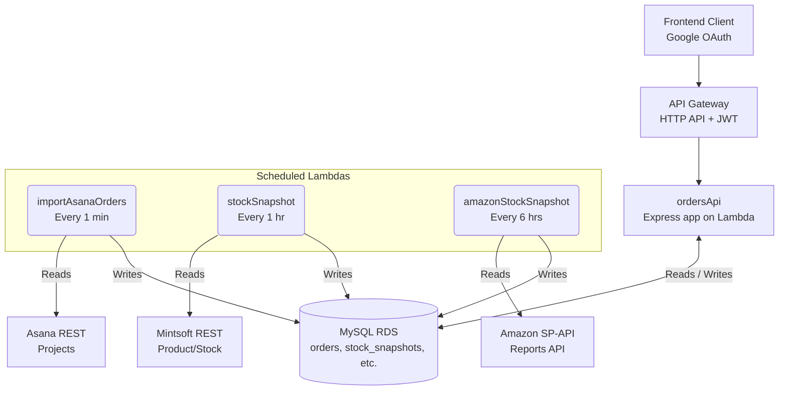
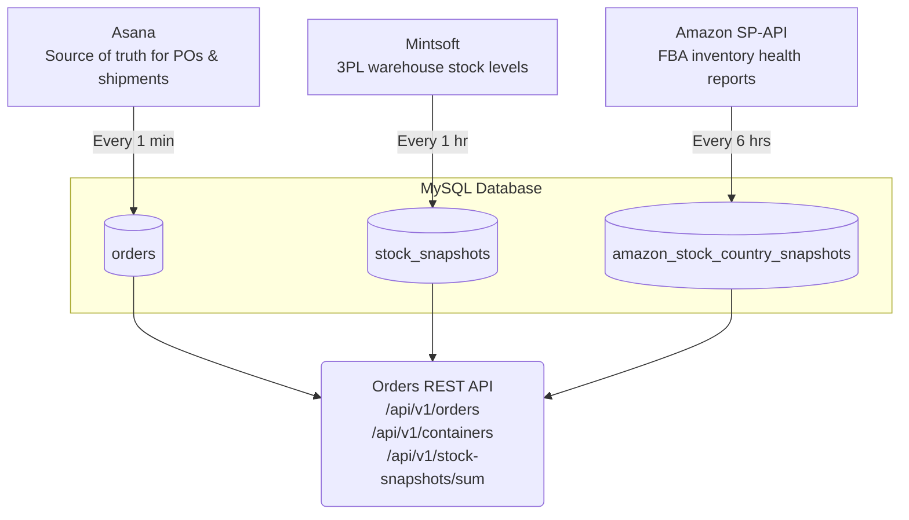
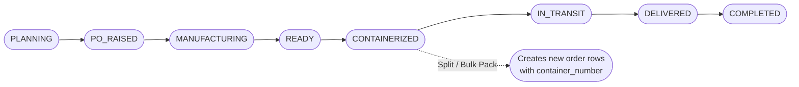

# 📦 Shipping & Orders Pipeline

A serverless backend designed to be the "single pane of glass" for tracking the full lifecycle of product shipments. It monitors everything from the moment a purchase order is raised, through manufacturing, containerisation, ocean transit, and final warehouse arrival. 

By aggregating stock data from **Mintsoft** (3PL warehouse), **Amazon SP-API** (FBA inventory), and **Asana** (order management) into a unified MySQL database, it provides a clean REST API for real-time inventory and logistics dashboards.

### 🛠 Tech Stack
* **Compute:** AWS Lambda (Node.js 18)
* **API Routing:** API Gateway (HTTP API)
* **Database:** MySQL (RDS)
* **Authentication:** Google JWT
* **Infrastructure as Code:** Serverless Framework v3

---

## 🏗 Architecture



### 🔄 Data Flow



### 🛤 Order Status Lifecycle



---

## 📂 Project Structure

```text
shipping/
  ├── orders.js                  # Express REST API (main entry point, Lambda handler)
  ├── stock-snapshot.js          # Scheduled Lambda: Mintsoft stock snapshots
  ├── amazon-stock-snapshot.js   # Scheduled Lambda: Amazon FBA inventory snapshots
  ├── import-asana-orders.js     # Scheduled Lambda: Asana order import
  ├── db.js                      # MySQL connection pool (singleton)
  ├── logger.js                  # Structured logging (timestamp + level)
  ├── mintsoft.js                # Mintsoft API client (product search & stock levels)
  ├── asanaService.js            # Asana API client (fetch project tasks)
  ├── asanaTransformer.js        # Transforms Asana tasks to flat row objects
  ├── statusMappers.js           # Maps Asana status strings to internal status enums
  ├── serverless.yml             # Serverless Framework deployment config
  ├── .env.example               # Template for required env vars
  └── .env                       # Environment variables (not committed)
```

---

## ⚡ Lambda Functions

| Function | File | Trigger | Purpose |
| :--- | :--- | :--- | :--- |
| `ordersApi` | `orders.js` | HTTP API (`/api/v1/*`) | Core REST API for frontend clients. |
| `stockSnapshot` | `stock-snapshot.js` | `rate(1 hour)` | Captures Mintsoft warehouse stock by JF code. |
| `amazonStockSnapshot` | `amazon-stock-snapshot.js` | `rate(6 hours)` | Captures Amazon FBA inventory per marketplace/country. |
| `importAsanaOrders` | `import-asana-orders.js` | `rate(1 minute)` | Syncs and replaces orders from tracked Asana projects. |

---

## 🌐 REST API Endpoints

*All endpoints require a Google JWT `Authorization` header (bypassed in local development).*

### Orders
| Method | Path | Description |
| :--- | :--- | :--- |
| **GET** | `/api/v1/orders` | List all orders (newest first) |
| **POST** | `/api/v1/orders` | Create a new order (defaults to `PLANNING` status) |
| **PUT** | `/api/v1/orders/:id` | Update specific order fields |
| **PATCH** | `/api/v1/orders/:id/status` | Move order to a new status (timestamps the transition) |
| **POST** | `/api/v1/orders/:id/split` | Split quantity off into a new `CONTAINERIZED` order |

### Containers
| Method | Path | Description |
| :--- | :--- | :--- |
| **POST** | `/api/v1/containers/pack` | Bulk-pack orders into a container (supports full or partial splits) |
| **PATCH** | `/api/v1/containers/:containerNumber/status` | Update status for all orders assigned to a specific container |

### Stock Snapshots
| Method | Path | Description |
| :--- | :--- | :--- |
| **GET** | `/api/v1/stock-snapshots/sum?asin=...&days=30` | Aggregated stock summary for a single ASIN across all platforms |
| **GET** | `/api/v1/stock-snapshots/sum/all-asins` | Full, system-wide stock summary for every known ASIN |

---

## 🗄️ Database Schema

### `orders`
The operational source of truth for shipments.

| Column | Type | Notes |
| :--- | :--- | :--- |
| `id` | VARCHAR | `ORD-XXXXXXXX` (UUID-based) or Asana task name |
| `asin` | VARCHAR | Amazon ASIN |
| `quantity` | INT | Units in this order line |
| `status` | VARCHAR | Current lifecycle status |
| `po_number` | VARCHAR | Purchase order reference |
| `container_number` | VARCHAR | Shipping container ID |
| `dates` | JSON | Timestamped status transitions (e.g., `{ planned: "...", shipped: "..." }`) |
| *(Additional)* | *Various* | Includes `product_name`, `supplier`, `vessel_name`, `eta`, `cbm`, `location` |

### `stock_snapshots`
Daily Mintsoft warehouse stock levels, keyed by SKU + warehouse + date.

| Column | Type | Notes |
| :--- | :--- | :--- |
| `jf_code` | VARCHAR | Internal JF product code |
| `sku` | VARCHAR | Mintsoft SKU (may include suffixes like `_QC`, `_READY`) |
| `date_ran` | DATE | Snapshot execution date |
| `stock_level` | INT | Total stock |
| `available` | INT | Available for sale |
| `allocated` | INT | Reserved/allocated |

### `amazon_stock_country_snapshots`
Amazon FBA inventory, populated via SP-API inventory health reports.

| Column | Type | Notes |
| :--- | :--- | :--- |
| `country` | VARCHAR | Marketplace code (`UK`, `DE`, `FR`, `ES`, `IT`) |
| `asin` | VARCHAR | Amazon ASIN |
| `fulfillable` | INT | Available at FBA |
| `inbound_*` | INT | Tracks `working`, `shipped`, and `receiving` states |
| `reserved` | INT | Pending orders or FC transfers |

*Note: The database also includes an `allowed_emails` table for API access control, and a `landed_costs` reference table mapping JF codes to ASINs.*

---

## 🔌 External Integrations

* **Mintsoft (3PL Warehouse):** Finds products by JF code and fetches per-warehouse breakdowns.
    * *Resilience:* Implements batched concurrent requests (max 10) with a 3-attempt exponential backoff retry mechanism.
* **Amazon SP-API:** Pulls TSV inventory health reports across multiple EU marketplaces using dual-account credentials (JFA, Hangerworld).
    * *Resilience:* If all marketplace calls fail, the system falls back to copying the last successful snapshot to prevent dashboard data gaps.
* **Asana (Project Management):** Currently serves as the user-facing interface for PO/Container tracking.
    * *Resilience:* Syncs via full-table replace, but strictly validates the incoming data fetch before truncating the `orders` table to prevent accidental data wiping.

---

## 🚀 Getting Started

### Prerequisites
* Node.js 18+
* MySQL Database (or AWS RDS instance)
* External platform credentials (Mintsoft API, Asana PAT, Amazon SP-API OAuth)

### Local Development

1. **Install dependencies:**
   ```bash
   npm install
   ```
2. **Configure environment:**
   Copy `.env.example` to `.env` and fill in your database and API credentials.
3. **Run the local API:**
   ```bash
   npm run dev
   # API will be available at http://localhost:3001
   
   # Alternatively, use Serverless Offline:
   npm run offline
   ```

### Manual Job Execution
You can manually trigger the scheduled jobs locally to populate your database:
```bash
node import-asana-orders.js
node stock-snapshot.js
node amazon-stock-snapshot.js
```

### Deployment
Deploy the full stack to AWS (`eu-north-1`) via the Serverless Framework:
```bash
npm run deploy
```

---

## 🧠 Key Design Decisions

1.  **Asana as the Interim Source of Truth:** Because operations currently run out of Asana, the system mirrors Asana every minute. Local CRUD operations exist primarily for container packing workflows, but general order details are overwritten by Asana. *(Roadmap: Replace Asana with a dedicated custom UI).*
2.  **Snapshot-Based Tracking:** Instead of event-streaming inventory changes, we take point-in-time snapshots. This drastically simplifies querying historical trends over configurable date ranges.
3.  **Connection Pooling in Lambda:** To prevent database connection exhaustion, a singleton MySQL pool (`db.js`, limit 5) is utilized and shared across Lambda invocations via container reuse.
4.  **Graceful Authentication Degradation:** In production, Google JWTs are strictly validated against an `allowed_emails` table. In local development (`IS_OFFLINE` or `NODE_ENV=development`), auth is cleanly bypassed, attributing requests to `local@dev`.